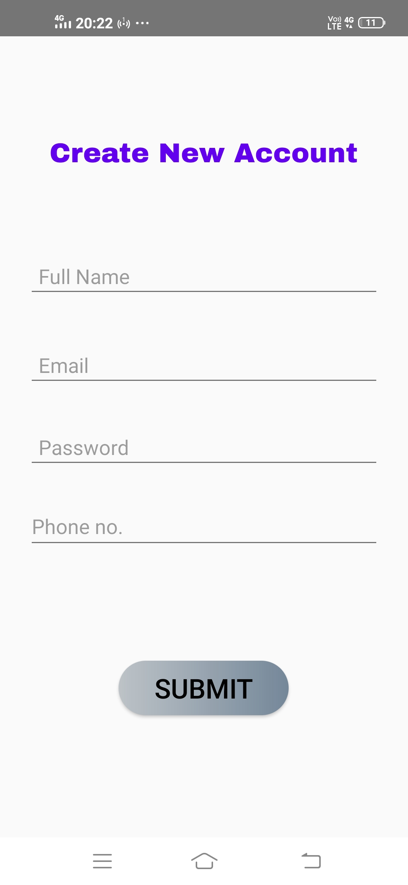
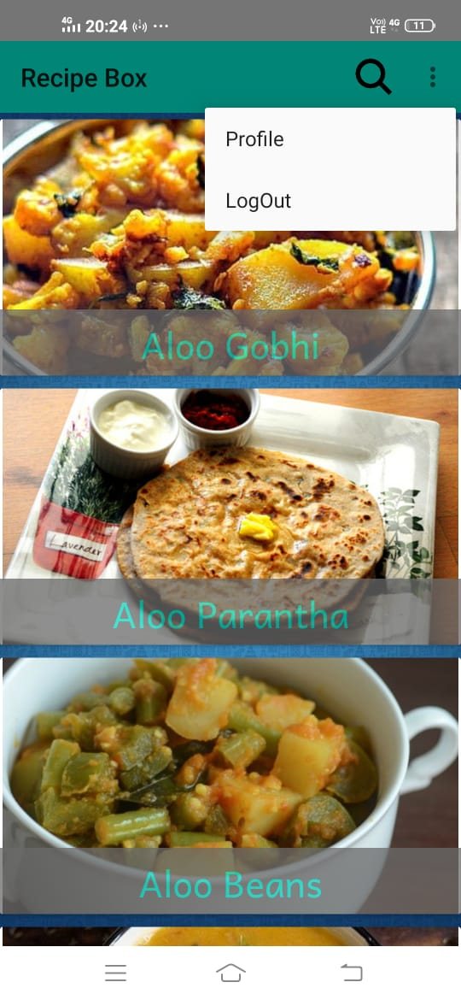

# RecipeBox

An android app that contains recipes.
You need to log in to use this app, if you dont have an account you can create a new one.

I learnt all these things using YouTube. I didn’t had any prior knowledge of Android Studio.

It was a fun project and I learned a lot.

## Getting Started
- Clone this repo and unzip the folder wherever you want.
- Launch Android Studio choose open project.
- Locate where you unziped this clone.
- Select **RecipeBox-master** folder, let the gradle sync.
- You are ready to go!

## Screenshots of the App

  
 

 
 
  
 
 
 
 
 
 

# Things I learned

- Developed a user interface within the xml file using RelativeLayout, ListView, SearchView, RecyclerView, ScrollView, & Button.
- Implemented functinality to the UI: onCreate, onAddItem, setupListViewListener, readItems, WriteItems.
- Used Firebase to authenticate user, created a database to store user's info & get that data form online database.
"# Recipe_Box" 
"# Recipe_Box" 
"# Recipe_Box" 
