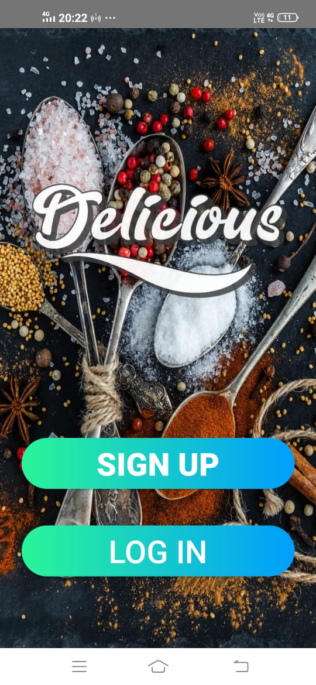
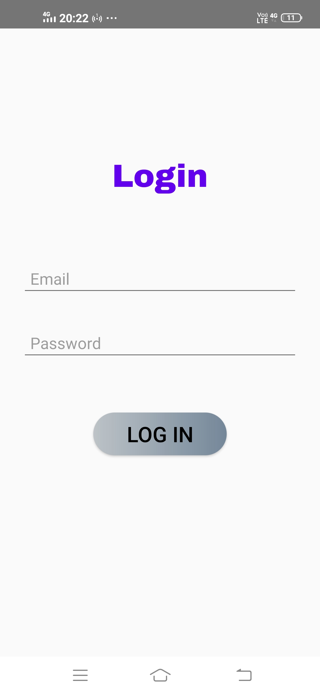
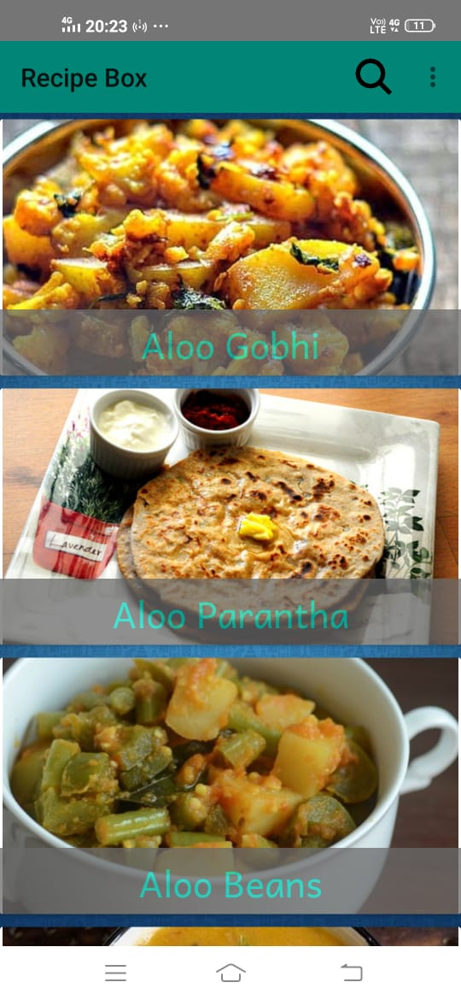
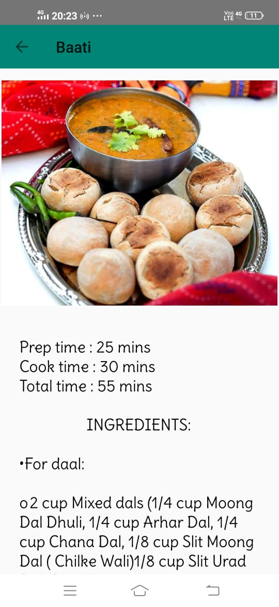
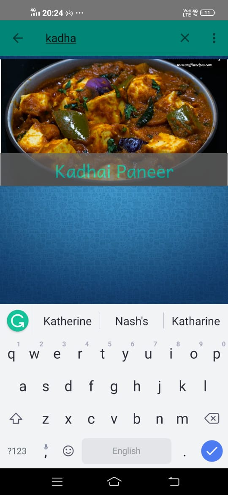
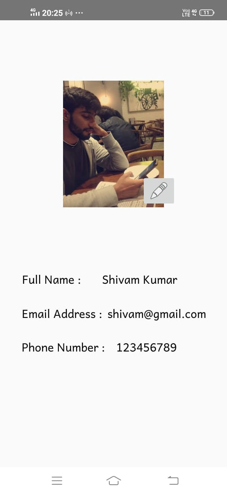

# RecipeBox

An android app that contains recipes.
You need to log in to use this app, if you dont have an account you can create a new one.

All the work done in this project is my work and everything was made ground up from scratch.

I learnt all these things using YouTube. I didn’t had any prior knowledge of Android Studio.

It was a fun project and I learnt a lot.

## Things I learnt

* Developed a user interface within the xml file using RelativeLayout, ListView, SearchView, RecyclerView, ScrollView, & Button.
* Implemented functinality to the UI: onCreate, onAddItem, setupListViewListener, readItems, WriteItems.
* Used Firebase to authenticate user, created a database to store user's info & get that data form online database.

## Screenshots of App

 &nbsp; &nbsp; &nbsp; &nbsp; &nbsp; &nbsp; &nbsp; &nbsp;  &nbsp; &nbsp; &nbsp; &nbsp; &nbsp; &nbsp; &nbsp; &nbsp; &nbsp; &nbsp; &nbsp; &nbsp; &nbsp; &nbsp; &nbsp; &nbsp; 

 
 

 &nbsp; &nbsp; &nbsp; &nbsp; &nbsp; &nbsp; &nbsp; &nbsp;  &nbsp; &nbsp; &nbsp; &nbsp; &nbsp; &nbsp; &nbsp; &nbsp; &nbsp; &nbsp; &nbsp; &nbsp; &nbsp; &nbsp; &nbsp; &nbsp; 

 
 

 &nbsp; &nbsp; &nbsp; &nbsp; &nbsp; &nbsp; &nbsp; &nbsp;  &nbsp; &nbsp; &nbsp; &nbsp; &nbsp; &nbsp; &nbsp; &nbsp; &nbsp; &nbsp; &nbsp; &nbsp; &nbsp; &nbsp; &nbsp; &nbsp; 

